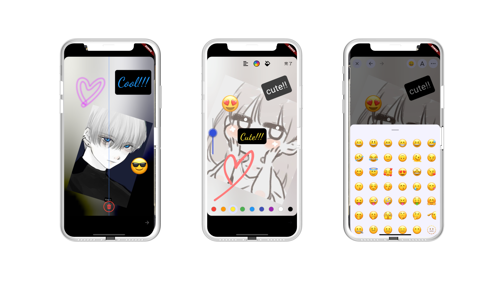

<a href="https://miroru.com/" align="center">
  <picture>
    <source media="(prefers-color-scheme: dark)" srcset="./doc/images/miroru-logo-dark.png">
    
  </picture>
</a>

<p align="center"></p>

## Features

miroru story editor is built with an emphasis on ease of theme customization and a modern, extensible architecture. It adheres to Material Design guidelines using ThemeData for all theming, simplifying the process of modifying the app's look and feel.

✅ **Intelligent Theme Adaptation**
Automatically adjusts the theme between dark and light modes based on the brightness of the selected background image, enhancing user experience and readability.

✅ **Quick Theme Customization**
Thanks to the utilization of ThemeData, changing themes to match your preferences or brand identity is straightforward and efficient.

✅ **Designed for Flexibility**
Our architecture ensures easy customization and future expansion, keeping miroru story editor at the forefront of technology advancements.

## Getting started

```yaml
dependencies:
  flutter:
    sdk: flutter
  miroru_story_editor: ^1.0.0
```

## Usage

```dart
FilledButton(
  onPressed: () async {
    if (Platform.isAndroid) {
      final deviceInfo = DeviceInfoPlugin();
      final androidInfo = await deviceInfo.androidInfo;
      if (androidInfo.version.sdkInt >= 33) {
        await Permission.photos.request();
      } else {
        await Permission.storage.request();
      }
    } else {
      await Permission.photos.request();
    }

    final file = await ImagePicker().pickImage(
      source: ImageSource.gallery,
    );
    if (file == null) {
      return;
    }

    if (!context.mounted) {
      return;
    }

    final imageData = await showMiroruStoryEditor(
      context,
      imageFile: File(file.path),
    );

    if (imageData == null) {
      return;
    }

      setState(() {
        image = imageData;
      });
    },
    child: const Text('open miroru story editor'),
  ),
```

## Change Theme

you can use #ThemeDataDto

```dart

  await showMiroruStoryEditor(
      context,
      imageFile: File(file.path),
      themeDataDto: ThemeDataDto(
        themeLight: yourLightTheme,
        themeDark: yourDarkTheme,
      ),
  );
```
